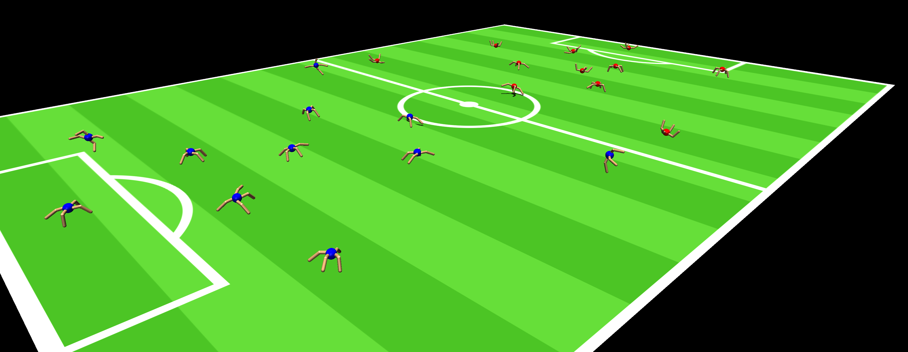

# RCSSServerMJ

Client-Server code for dynamic loading of MuJoCo robots.



Video: https://youtu.be/iYWw7vATQU4


### Installation
- ```pip install -r requirements.txt```

### Instructions
Start the server:
```python mujoco_server.py localhost 60000```  
where the first argument is the host and the second is the port.

#### Start clients one by one
Start a client:
```python mujoco_client.py localhost 60000 0 1```  
where the first and second argument are host and port of the server, the third is the team number (0 or 1), and the fourth is the player number (1 - 11).

Disconnect a client: Simply ctrl+c the client process.

#### Start full teams
Start the first team:
```bash start_team.sh 0```

Start the second team:
```bash start_team.sh 1```


### Credit
- Pitch texture taken from [dm_control](https://github.com/google-deepmind/dm_control/blob/main/dm_control/locomotion/soccer/assets/pitch/pitch_nologo_l.png)
- Ant XML taken from [gymnasium](https://github.com/Farama-Foundation/Gymnasium/blob/main/gymnasium/envs/mujoco/assets/ant.xml)
